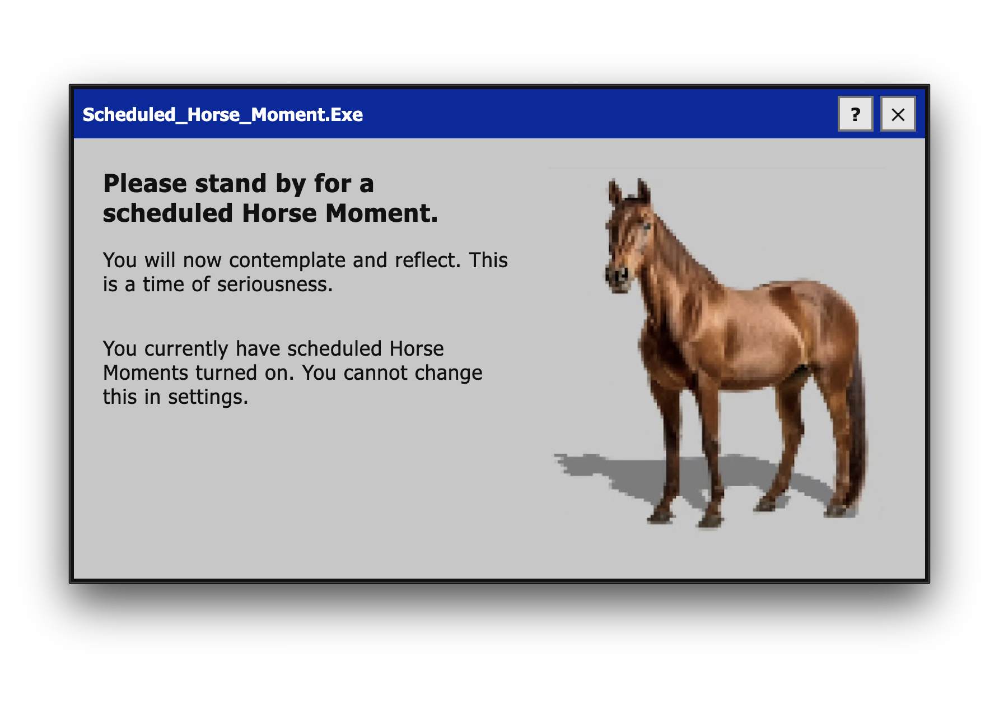

# Horse Time



Minimal cross-platform electron app, that provides ___horse time___ when necessary.

**Prerequisites**
- **macOS** (for building macOS distributables). You can run the app on other platforms for development.
- **Node.js & npm** (tested with Node 18+). Install via Homebrew: `brew install node`.
- **horse**. A different horse, if wanted. One has been included to make your life easy.

**Install dependencies and run (development)**

Open a terminal and run:

```bash
cd <path to folder>/horse-time
npm install
```

Start the app for local testing (this opens the Electron window):

```bash
npm run start
```

Close the window or press the custom `x` button to quit horse time (you probably won't want to).

**Installing on macOS**

If macOS reports the app as "damaged and cannot be opened":

- Right-click the app in Finder → Open → click Open.
- To remove the quarantine attribute for a trusted download:

```bash
# For a mounted DMG
hdiutil attach /path/to/Horse-Time.dmg
xattr -r -d com.apple.quarantine /Volumes/<MountName>/*.app

# For the installed app
xattr -r -d com.apple.quarantine /Applications/Horse\ Time.app
```

**Running on Windows**

Download the exe from the latest release, open the exe.

# Inspiration

[The horse](https://www.instagram.com/p/DUg1VTgjdRO/).